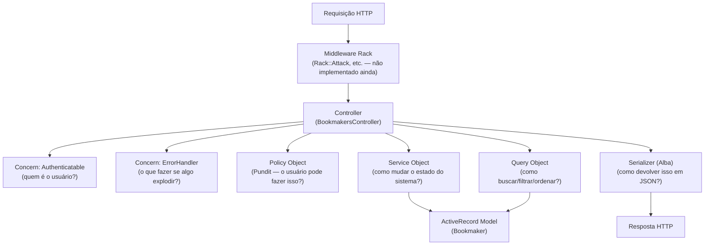

# O ecossistema de `BookmakersController`: uma aula de arquitetura Rails

> Documento de mentoria. Objetivo: você sair daqui entendendo não só *o que* o código faz,
> mas *por que* ele foi desenhado assim, quais padrões estão em jogo, onde a arquitetura
> quebra na prática (com prova, não achismo) e que trade-offs você está aceitando ao manter
> esse desenho.

Tudo que está descrito abaixo eu confirmei lendo o código-fonte real do repositório e, nos
pontos marcados como **bug confirmado**, executando o código (via `bin/rails runner`,
`rspec` e scripts Ruby isolados) para provar o comportamento — não é suposição.

---

## 1. Panorama: por que "Controller Fino"?

O padrão que este projeto persegue chama-se **Thin Controller, Fat... nada** — na verdade
nem é "fat model". É uma variação mais moderna, às vezes chamada de **Service-Oriented
Rails** ou **Trailblazer-lite**, em que a lógica não vai nem para o controller nem para o
model, mas para objetos de responsabilidade única ao redor deles:



A ideia central — e isso é **o** conceito que você precisa internalizar — é a
**Separação de Responsabilidades (Separation of Concerns / SRP)**: o controller não decide
*como* buscar dados, nem *se* o usuário pode agir, nem *como* apresentar a resposta. Ele
apenas **orquestra** chamadas a objetos especialistas. Isso é literalmente a definição de
controller em uma arquitetura MVC bem feita: um **tradutor entre o mundo HTTP e o domínio**,
não um lugar onde regras de negócio moram.

Compare o tamanho de `destroy`:

```ruby
def destroy
  bookmaker = current_user.bookmakers.find(params[:id])
  Bookmakers::DestroyService.call(bookmaker:)
  head :no_content
end
```

com o que aconteceria num "Rails clássico ingênuo" (o que a comunidade chama de
**Fat Controller anti-pattern**):

```ruby
# NÃO é o que o projeto faz — é o contraponto didático
def destroy
  bookmaker = Bookmaker.find(params[:id])
  return render json: { error: "forbidden" }, status: 403 unless bookmaker.user_id == current_user.id
  if bookmaker.accounts.active.exists?
    return render json: { error: "cannot delete, has active accounts" }, status: 422
  end
  ActiveRecord::Base.transaction do
    bookmaker.accounts.destroy_all
    bookmaker.destroy!
  end
  head :no_content
rescue => e
  render json: { error: e.message }, status: 500
end
```

O segundo é ilegível, não testável isoladamente, e mistura quatro responsabilidades
(autorização, regra de negócio, persistência, apresentação de erro) numa função. O projeto
evita isso — e isso é o acerto arquitetural mais importante que ele faz.

---

## 2. As camadas, uma a uma

### 2.1 Controller — `Api::V1::BookmakersController`

```ruby
module Api
  module V1
    class BookmakersController < ApplicationController
      include Authenticatable
      # index, show, create, destroy
    end
  end
end
```

Dois detalhes de nomenclatura Rails que valem a explicação:

- **Namespace `Api::V1`**: isso não é só organização de pasta. Em Rails, módulos aninhados
  (`Api::V1::BookmakersController`) mapeiam para `app/controllers/api/v1/bookmakers_controller.rb`
  via **Zeitwerk** (o autoloader do Rails desde a versão 6). O nome do arquivo e o caminho de
  pastas *precisam* corresponder exatamente ao nome completo da constante Ruby. Isso vai ser
  crucial na Seção 4 — é exatamente essa regra que está sendo violada em outro lugar do código.
- **Versionamento de API via namespace** (`v1`) é uma escolha deliberada: quando a API
  evoluir de forma incompatível (breaking change), cria-se `Api::V2` sem quebrar clientes do
  `V1`. Trade-off: duplicação de controllers entre versões ao longo do tempo, mitigada
  normalmente concentrando lógica nas camadas de baixo (services/queries), que não são
  versionadas — e é exatamente isso que o projeto faz: os `Bookmakers::*Service` não sabem
  que existe uma "v1".

### 2.2 `ApplicationController` — a raiz de tudo

```ruby
class ApplicationController < ActionController::API
  include Pundit::Authorization
  include Pagy::Backend
  include ErrorHandler

  rescue_from ActiveRecord::RecordNotFound, with: :render_not_found
  rescue_from Pundit::NotAuthorizedError, with: :render_forbidden
  rescue_from Pagy::OverflowError, with: :render_not_found
  ...
end
```

- `ActionController::API` (não `ActionController::Base`): como o app é `api_only = true`
  (ver `config/application.rb`), não há views, cookies de sessão, proteção CSRF baseada em
  formulário, nem asset pipeline. Isso é coerente com uma API JSON stateless.
- `rescue_from` é o mecanismo do Rails para **centralizar tratamento de exceção por tipo**,
  em vez de `begin/rescue` espalhado em cada action. É essencialmente o **padrão
  Chain of Responsibility** aplicado a exceções: Rails percorre a lista de handlers
  registrados e usa o mais específico/mais recente que casa com a exceção levantada.
  Guarde esse "mais recente" — ele é a causa de um bug real que vamos provar na Seção 4.3.

### 2.3 Concerns — mixins de comportamento transversal

Um **Concern** em Rails é um módulo que usa `ActiveSupport::Concern` para se comportar como
um mixin "esperto": ele pode injetar `before_action`, `rescue_from`, métodos de instância e
de classe no controller que o inclui, num bloco `included do ... end`.

**`Authenticatable`** — resolve "quem está fazendo essa requisição":

```ruby
module Authenticatable
  extend ActiveSupport::Concern
  included { before_action :authenticate_user! }

  private

  def authenticate_user!
    token = request.headers["Authorization"]&.split(" ")&.last
    return render_unauthorized if token.blank?
    payload = Jwt::Decoder.call(token: token)
    @current_user = User.find(payload["user_id"])
  end
  ...
end
```

Isso implementa autenticação **stateless via JWT Bearer token** — nenhuma sessão no servidor,
nenhum cookie. É o padrão correto para uma API que pode ser consumida por SPAs, apps mobile,
outros serviços etc. O trade-off clássico (JWT vs sessão em banco/Redis) é: JWT escala
horizontalmente sem estado compartilhado, mas **revogar um token antes da expiração é difícil**
(não há registro central "esse token é válido"). Isso é aceitável aqui porque o projeto é
fase de fundação, mas é uma decisão que voltará à mesa quando "logout" ou "banimento
imediato de usuário" vierem ao roadmap.

**`ErrorHandler`** — resolve "o que a API responde quando algo dá errado, de forma
consistente":

```ruby
module ErrorHandler
  extend ActiveSupport::Concern
  included do
    rescue_from ApplicationError, with: :render_business_error
    rescue_from ActiveRecord::RecordNotFound, with: :render_not_found
  end
  ...
end
```

A intenção é boa: um único formato de erro (`{ error: { code:, message: } }`) para toda
exceção de negócio (`ApplicationError` e suas subclasses) e para "não encontrado". Isso é
importante para quem consome a API — um frontend não deveria precisar tratar `N` formatos de
erro diferentes. **Só que essa boa intenção está sendo sabotada silenciosamente — ver 4.3.**

### 2.4 Query Objects — `Bookmakers::IndexQuery`, `FilterQuery`, `SearchQuery`, `SortQuery`

```ruby
def call
  relation
    .then { filter(_1) }
    .then { search(_1) }
    .then { sort(_1) }
end
```

Isso é o **padrão Query Object**: em vez de scopes do ActiveRecord se acumulando dentro do
model (`Bookmaker.by_status.by_country.search(...).sorted`) — o que rapidamente vira um
model com 30 scopes que ninguém entende quem usa — cada preocupação de consulta vira uma
classe isolada, testável sozinha, com uma única responsabilidade.

O uso de `.then { ... }` (antigo `Object#yield_self`) para encadear transformações é
**Railway-Oriented Programming** de forma bem leve: cada etapa recebe o relation resultante
da anterior e devolve outro relation, sem branches condicionais no meio. É um estilo
funcional aplicado a ActiveRecord::Relation (que é, ela mesma, um objeto imutável/composável
por natureza — cada `.where` devolve uma *nova* relation).

Repare também no truque de **reflexão via constantes do model**:

```ruby
# SearchQuery
searchable_fields = relation.klass::SEARCHABLE_FIELDS
# SortQuery
def sortable_fields = relation.klass::SORTABLE_FIELDS
def default_sort    = relation.klass::DEFAULT_SORT
```

`SearchQuery` e `SortQuery` **não são específicas de `Bookmaker`** — não estão nem dentro do
módulo `Bookmakers` (moram em `app/queries/search_query.rb`, top-level). Elas são genéricas:
funcionam para *qualquer* model que declare `SEARCHABLE_FIELDS` / `SORTABLE_FIELDS` /
`DEFAULT_SORT` como constantes. Isso é o padrão **Convention over Configuration** aplicado
via *duck typing por convenção de nome de constante* — uma forma (não muito comum, mas
válida) de fazer polimorfismo sem herança nem interface explícita. `FilterQuery`, em
contraste, **é** específica (`FILTERABLE_FIELDS` está *dentro* da própria query, não no
model), porque filtro exato por igualdade tende a ser mais específico do recurso do que busca
textual/ordenação genéricas. É uma escolha de design defensável, mas vale notar a
inconsistência: por que `SEARCHABLE_FIELDS`/`SORTABLE_FIELDS` vivem no model e
`FILTERABLE_FIELDS` vive na query? Não há uma resposta técnica forte — é uma decisão que
merece ser documentada (ou unificada) antes que um segundo desenvolvedor copie o padrão
errado por engano.

### 2.5 Service Objects — `Bookmakers::CreateService`, `DestroyService`

```ruby
module Bookmakers
  class CreateService
    def self.call(user:, params:) = new(user: user, params: params).call

    def call
      bookmaker = nil
      ActiveRecord::Base.transaction { bookmaker = @user.bookmakers.create!(@params) }
      success(bookmaker)
    rescue ActiveRecord::RecordInvalid => e
      failure(e.record.errors.full_messages)
    end
    ...
  end
end
```

**Service Object** é o padrão para lógica que *muda o estado do sistema* e não tem um lar
óbvio em um único model (ou envolve mais de um). O `self.call` como fachada de classe (em
vez de forçar quem chama a fazer `Service.new(...).call`) é uma convenção extremamente comum
na comunidade Rails (vem de Reform/Trailblazer, popularizado por muitos guias — inclusive é
citado no seu próprio `README.md`).

Pontos a notar:

- **Retorno como Hash (`{ success:, bookmaker: }` / `{ success:, errors: }`)** em vez de
  levantar exceção em `CreateService`: isso é o padrão **Result Object** — o chamador decide
  o que fazer com sucesso/falha sem precisar de `begin/rescue`. É uma escolha de estilo
  válida (evita usar exceções para controle de fluxo esperado, como "validação falhou", que
  não é excepcional — é um caminho normal do domínio).
- **`DestroyService`, por outro lado, não segue esse padrão** — ele não retorna um Result
  Object, apenas chama `bookmaker.destroy!` (que levanta exceção em caso de falha). Isso é
  uma **inconsistência de convenção entre os dois services do mesmo namespace**: um dev lendo
  `CreateService` aprende "o padrão daqui é Result Object", tenta aplicar o mesmo raciocínio
  em `destroy` no controller (`if result[:success] ... else ...`) e vai estar errado, porque
  `destroy` no controller não trata resultado nenhum — ele deixa a exceção subir para o
  `rescue_from`. **Duas filosofias de tratamento de erro coexistindo na mesma pasta.** Isso
  não é um bug de runtime, mas é uma dívida de consistência que confunde quem já é
  desenvolvedor e come tempo de quem está aprendendo (você).

### 2.6 Policy Objects — Pundit (`BookmakerPolicy`, `ApplicationPolicy`)

```ruby
class BookmakerPolicy < ApplicationPolicy
  def show?    = owns_record?
  def update?  = owns_record?
  def destroy? = owns_record?

  class Scope < Scope
    def resolve = scope.where(user_id: user.id)
  end

  private
  def owns_record? = bookmaker.user_id == user.id
end
```

**Pundit** implementa o padrão **Policy Object**: em vez de `if current_user.admin? || ...`
espalhado em controllers e views, cada regra de autorização vira um método nomeado
(`show?`, `destroy?`) numa classe dedicada por recurso. `ApplicationPolicy` nega tudo por
padrão (`false` em todo método) — isso é **secure by default / fail closed**: um novo recurso
que esqueça de definir uma policy específica bloqueia acesso em vez de liberar. É a escolha
certa em segurança (o oposto, "permitir por padrão", é como vazam dados por omissão).

`Scope` implementa a variante para **coleções**: `policy_scope(Bookmaker)` usado em `index`
delega para `BookmakerPolicy::Scope#resolve`, que filtra a query para só bookmakers do
usuário — a autorização acontece *na query SQL*, não filtrando em Ruby depois de buscar tudo
do banco (o que seria um desperdício e um risco: fácil esquecer o filtro numa página futura).

**Só que:** olhe os quatro `def` de autorização real (`show?`, `update?`, `destroy?` usam
`owns_record?`; não existe `create?` nem `index?` sobrescritos aqui — usam o `false` padrão
da superclasse, o que teoricamente bloquearia `index` e `create`, só que nenhuma dessas duas
actions no controller chama `authorize`/`policy_scope` da forma que dispararia esse `false`
de forma útil — ver Seção 4.4, é o coração do problema de autorização inconsistente deste
controller). Isso não é acidental de leitura sua — é genuinamente confuso mesmo para quem já
manja, e é a falha arquitetural mais importante do arquivo.

### 2.7 Serializer — Alba (`BookmakerSerializer`)

```ruby
class BookmakerSerializer
  include Alba::Resource
  attributes :id, :name, :country, :status
  attribute(:homepage) { |bookmaker| bookmaker.website }
end
```

**Alba** é uma gem de serialização JSON (concorrente mais leve e mais rápida que
`ActiveModel::Serializers` ou `jsonapi-serializer`/`fast_jsonapi`, que estão descontinuadas
ou mortas). O papel dela é o padrão **Presenter/Decorator para saída**: desacoplar "o que o
banco de dados guarda" (`website`) de "o que a API expõe" (`homepage`) — aqui já dá pra ver
o valor disso: o campo interno `website` é renomeado para `homepage` na borda pública sem
tocar no schema do banco. Isso é exatamente o tipo de indireção que vale o custo: sem
serializer, qualquer `rename_column` no banco vira breaking change de API automaticamente.

---

## 3. Fluxo completo de cada action

**`GET /bookmakers` (`index`)**
1. `Authenticatable#authenticate_user!` roda como `before_action` → decodifica JWT → seta `@current_user`.
2. `policy_scope(Bookmaker)` → `BookmakerPolicy::Scope#resolve` → SQL já filtrado por `user_id`.
3. `Bookmakers::IndexQuery.call` → aplica filtro (status/country), busca textual, ordenação, em cadeia.
4. `pagy(relation)` → pagina (gem Pagy).
5. `BookmakerSerializer` → serializa para hash.
6. Resposta `{ data:, meta: }`.

**`GET /bookmakers/:id` (`show`)**
1. Autenticação (concern).
2. `Bookmaker.find(params[:id])` — busca **sem** escopo de usuário (busca em toda a tabela!).
3. `authorize bookmaker` — Pundit chama `BookmakerPolicy#show?` explicitamente; se `false`, levanta `Pundit::NotAuthorizedError` → capturado no `ApplicationController` → 403.
4. Serializa e responde.

**`POST /bookmakers` (`create`)**
1. Autenticação.
2. `bookmaker_params` — strong parameters, só permite `name/website/country/status`.
3. `Bookmakers::CreateService.call(user:, params:)` roda dentro de transação, cria via
   `@user.bookmakers.create!` (associação já escopada — a segurança aqui vem da
   associação `belongs_to`, não de uma policy explícita).
4. Sucesso → 201; falha de validação → 422 com mensagens do ActiveRecord.

**`DELETE /bookmakers/:id` (`destroy`)**
1. Autenticação.
2. `current_user.bookmakers.find(params[:id])` — busca **já escopada** por usuário via associação
   (padrão diferente do `show`!). Se o registro pertence a outro usuário, isso levanta
   `ActiveRecord::RecordNotFound` (404), **não** `Pundit::NotAuthorizedError` (403).
3. `Bookmakers::DestroyService.call(bookmaker:)` → (deveria) validar regra de negócio e destruir.
4. `head :no_content` (204).

Compare o passo 2 de `show` com o passo 2 de `destroy`: são duas estratégias de autorização
**diferentes** para o mesmo tipo de recurso. Isso é o assunto da próxima seção.

---

## 4. Falhas de arquitetura — confirmadas, não especuladas

Nesta seção cada item foi **reproduzido** por mim rodando o código do repositório antes de
escrever isto. Não é uma lista de "possíveis problemas" — é o que o código realmente faz
hoje.

### 4.1 🔴 Crítico: `Jwt::Decoder` nunca captura `JWT::DecodeError` em runtime

```ruby
module Jwt
  class Decoder
    SECRET_KEY = Rails.application.credentials.secret_key_base

    def self.call(token:)
      decoded_token = JWT.decode(token, SECRET_KEY, true, { algorithm: "HS256" })
      decoded_token.first
    end
  rescue JWT::DecodeError
    nil
  end
end
```

Repare no `rescue` **fora** do `def self.call ... end`, mas dentro do `class Decoder ... end`.
Desde o Ruby 2.5, `class`/`module` aceitam `rescue` "sem `begin`" — mas isso significa que o
`rescue` protege a **execução do corpo da classe no momento da definição** (ou seja, quando o
Ruby carrega esse arquivo e define o método), **não** as chamadas futuras de `.call`. Eu
provei isso isoladamente:

```ruby
class Foo
  def self.call
    raise "boom"
  end
rescue RuntimeError
  puts "nunca chega aqui quando Foo.call é chamado depois"
end

Foo.call
# => RuntimeError: boom  (não capturado!)
```

Resultado real ao rodar: `"caught at call-site because class-body rescue did NOT wrap the
method call"`. **O `rescue` do `Jwt::Decoder` é morto — nunca vai capturar nada.**

**Impacto real**: mande um `Authorization: Bearer token-invalido` para qualquer endpoint
autenticado. `JWT.decode` levanta `JWT::DecodeError`. Ninguém no `ApplicationController`
tem `rescue_from JWT::DecodeError`. Resultado: **um token JWT malformado ou adulterado
derruba a requisição com 500 Internal Server Error**, em vez do 401 esperado. Isso não é só
um bug cosmético — é uma **falha de tratamento de erro na borda de autenticação**, a
superfície mais sensível de uma API. Um scanner de segurança automatizado batendo tokens
inválidos vai gerar uma quantidade grande de 500s (ruído em logs/alertas, possível vetor de
DoS barato se o 500 for caro de gerar).

**Correção**: mover o `rescue` para dentro do método:

```ruby
def self.call(token:)
  JWT.decode(token, SECRET_KEY, true, { algorithm: "HS256" }).first
rescue JWT::DecodeError
  nil
end
```

### 4.2 🔴 Crítico: `Bookmakers::DestroyService` não existe (viola convenção do Zeitwerk)

Arquivo `app/services/bookmakers/destroy_service.rb`:

```ruby
class DestroyService   # deveria ser Bookmakers::DestroyService
  ...
end
```

O controller chama `Bookmakers::DestroyService.call(bookmaker:)`. Rodei diretamente:

```
$ bin/rails runner 'puts Bookmakers::DestroyService'
expected file /home/.../app/services/bookmakers/destroy_service.rb
to define constant Bookmakers::DestroyService, but didn't
```

Essa é a regra de ouro do Zeitwerk que eu mencionei na Seção 2.1: **caminho de arquivo ⇔
nome completo da constante**, sem exceção. `app/services/bookmakers/destroy_service.rb` só
pode definir `Bookmakers::DestroyService`. Como o arquivo define `::DestroyService`
(top-level), a autoload falha assim que algo tenta referenciar `Bookmakers::DestroyService`.

**Impacto real**: `DELETE /bookmakers/:id` está **quebrado agora mesmo** em qualquer
ambiente com autoload estrito (dev/test — e em produção, se `eager_load` estiver ligado,
a aplicação **nem sobe**). Não é hipótese — é o estado atual do branch.

**Correção**: envolver a classe no módulo:

```ruby
module Bookmakers
  class DestroyService
    ...
  end
end
```

### 4.3 🟠 Alto: dois `rescue_from` conflitantes para `ActiveRecord::RecordNotFound`

`ApplicationController` inclui `ErrorHandler` (que registra
`rescue_from ActiveRecord::RecordNotFound, with: :render_not_found` apontando para o
`render_not_found` **do concern**, formato `{ error: { code:, message: } }`) e, logo em
seguida, registra o **seu próprio**
`rescue_from ActiveRecord::RecordNotFound, with: :render_not_found` (apontando para o
`render_not_found` **local**, formato `{ error: "Not found" }` — uma string, não um hash).

O Rails resolve exceções percorrendo os handlers registrados **do mais recente para o mais
antigo** e usa o primeiro que casar (`ActiveSupport::Rescuable#handler_for_rescue` reverte o
array e faz `detect`). Eu simulei a estrutura de dados exata que o Rails usa:

```
[["RecordNotFound", concern_handler], ["RecordNotFound", controller_handler]]
=> o último registrado (controller_handler) vence
```

Como `include ErrorHandler` roda **antes** do `rescue_from` explícito escrito no corpo de
`ApplicationController`, o handler do `ErrorHandler` é **silenciosamente descartado** para
`RecordNotFound`. Isso explica por que `destroy_spec.rb` (que você tem em progresso) espera
`error_response["code"] == "not_found"` — um hash — mas o que a API de fato devolve para
"não encontrado" é `{ "error" => "Not found" }`, uma string. `["code"]` numa String em Ruby
não levanta erro (indexação por posição/regex), mas devolve algo sem sentido — o teste vai
falhar de um jeito confuso, não óbvio.

Pior: isso quer dizer que **o formato de erro da sua API não é consistente** — `404` vem num
formato, e um `ApplicationError` de negócio (Seção 4.5) viria no formato do `ErrorHandler`,
porque só `RecordNotFound` tem essa duplicata. Um cliente de API vai precisar tratar dois
formatos de erro diferentes dependendo do tipo de falha — o oposto do que `ErrorHandler` foi
criado para resolver.

**Correção**: escolha **um** lugar para `rescue_from ActiveRecord::RecordNotFound`. Como
`ErrorHandler` já existe com essa finalidade, eu tiraria a duplicata do
`ApplicationController` e deixaria só o concern ser dono disso — reforça a ideia de que
"tratamento de erro" é uma responsabilidade e mora num lugar só.

### 4.4 🟠 Alto: três estratégias de autorização diferentes convivendo no mesmo controller

| Action | Como restringe acesso | Resposta se não for o dono |
|---|---|---|
| `index` | `policy_scope(Bookmaker)` — filtra no SQL | (não aparece na lista — não é "erro", é omissão) |
| `show` | `Bookmaker.find` (global) + `authorize bookmaker` (Pundit explícito) | `403 Forbidden` |
| `create` | `@user.bookmakers.create!` (escopo via associação) | N/A (sempre cria para si) |
| `destroy` | `current_user.bookmakers.find` (escopo via associação) | `404 Not Found` |

Note que `show` e `destroy` protegem o **mesmo tipo de acesso indevido** ("tentar acessar o
bookmaker de outra pessoa pelo ID") de duas formas com **semânticas HTTP diferentes**: uma
devolve 403 (existe, mas você não pode), a outra devolve 404 (finge que não existe). Do
ponto de vista de segurança, 404 é geralmente a escolha *mais defensiva* (não revela a um
atacante que o ID existe — evita **enumeração de recursos**), então dá pra argumentar que
`destroy` está mais certo que `show`. Mas ter as duas estratégias **na mesma classe** é o
problema: o próximo desenvolvedor (ou você, daqui a 3 meses) não vai saber qual copiar ao
implementar `update`, e o `BookmakerPolicy` fica com métodos (`show?`, `update?`, `destroy?`)
que sugerem "toda autorização passa pelo Pundit", quando na prática `destroy` **nunca chama
`authorize`** — o método `destroy?` da policy é código morto hoje, apesar de existir e
parecer que está em uso.

**Correção**: escolher uma estratégia canônica e documentá-la (eu recomendaria: sempre
`authorize` explícito com Pundit, e a policy decide se devolve 403 ou deixa vazar 404 —
Pundit tem suporte pra isso via `NotFoundError` customizado — em vez de dois caminhos de
busca diferentes por action).

### 4.5 🟡 Médio: regra de negócio "não deletar bookmaker com contas ativas" existe como classe de erro, mas não é usada

```ruby
module Bookmakers
  class ActiveAccountsExistError < ApplicationError
    def initialize
      super(code: "active_accounts_exist", message: "Cannot delete bookmaker with active accounts.")
    end
  end
end
```

Essa classe existe, herda de `ApplicationError` (que `ErrorHandler` sabe tratar), tem
código e mensagem prontos — mas **nada no `DestroyService` a levanta**. `DestroyService#call`
é só `bookmaker.destroy!`. O teste que você está escrevendo agora
(`spec/requests/api/v1/bookmakers/destroy_spec.rb`, contexto "when the bookmaker has active
accounts") descreve exatamente esse comportamento esperado e vai falhar, porque a regra
simplesmente não foi implementada ainda — nem há sequer uma associação `has_many :accounts`
no model `Bookmaker`, nem uma tabela `accounts` no schema.

Isso não é bem uma "falha de arquitetura" no sentido de desenho ruim — é trabalho
inacabado, o que é normal em progresso. Mas do ponto de vista arquitetural vale o
aprendizado: **criar a classe de erro antes do código que a usa é preparar terreno demais
adiantado** (viola um pouco o espírito de YAGNI/simplicidade que você mesmo prioriza) — ou é
exatamente o próximo passo natural do TDD (escrever o teste e a peça de erro primeiro,
implementar depois). As duas leituras são válidas; a diferença é só se você trata isso como
"código morto temporário" (ok, com TODO) ou "acabar antes de mergear".

### 4.6 🟡 Médio: `app/services/bookmakers/update_service.rb` existe e está vazio

Zero bytes. Não há rota `PATCH/PUT /bookmakers/:id` em `config/routes.rb`
(`resources :bookmakers, only: [:create, :index, :show]` — nem `destroy` está na lista de
`only:`, o que é outra pegadinha: a rota `DELETE` também não está declarada nas routes!
Vamos confirmar isso — veja a nota abaixo). Isso é sinal de planejamento de nomenclatura
adiantado sem implementação — inofensivo por enquanto (arquivo vazio não quebra o Zeitwerk,
só quebraria se algo tentasse referenciar `Bookmakers::UpdateService` antes dele ter
conteúdo), mas é lixo a limpar antes do merge.

> **Nota importante que vale seu tempo agora**: eu li `config/routes.rb` e a linha é
> `resources :bookmakers, only: [ :create, :index, :show ]` — **sem `:destroy`**. Isso
> significa que, além dos dois bugs críticos acima, `DELETE /api/v1/bookmakers/:id` **nem
> tem rota registrada** neste momento. Some os três problemas (rota ausente + service sem
> namespace + decoder JWT quebrado em caso de erro) e o quadro é: a feature de destroy está,
> hoje, em três pontos de falha diferentes antes mesmo de chegar na regra de negócio. Vale
> resolver do fim para o começo: rota → autoload do service → regra de negócio → depois
> rodar os testes.

### 4.7 🟢 Baixo: `serializable_hash` vs `serialize` usados de forma inconsistente

`index` chama `BookmakerSerializer.new(bookmakers).serializable_hash` (devolve um `Hash`
Ruby); `show` e `create` chamam `.serialize` (devolve uma `String` JSON já formatada). Os
dois funcionam com `render json:` (Rails aceita ambos), mas é inconsistente e sugere que
quem escreveu não tinha certeza de qual API do Alba usar. Sem impacto funcional, mas some
esse ruído — escolha um e documente por quê (dica: `serializable_hash` é geralmente
preferível quando você ainda quer compor a resposta com `meta`, como faz o `index` — então
faz sentido `show`/`create` também usarem `serializable_hash` por consistência, envolvendo
em `{ data: ... }` como o `index` faz, já que isso também padronizaria o formato do corpo
da resposta entre endpoints, hoje `index` devolve `{ data:, meta: }` e `show`/`create`
devolvem o objeto solto, sem o envelope `data`).

---

## 5. Trade-offs que vale você entender, não só decorar

Isso aqui é a parte "por que isso é uma escolha, não a única forma certa":

1. **Service Objects vs. "Fat Model"** (colocar tudo em métodos de `Bookmaker`).
   Service objects ganham em: testabilidade isolada, nomes de ação explícitos
   (`CreateService` > `Bookmaker#create_with_validation_and_notification`), e evitam que o
   model vire um "God Object" com 50 métodos. Perdem em: mais arquivos, mais indireção — para
   entender "o que acontece quando crio um bookmaker" você navega por 2-3 arquivos em vez
   de 1. Para um projeto pequeno isso pode parecer over-engineering; para um projeto que quer
   crescer (seu objetivo declarado de portfólio sênior) é o investimento certo, **desde que
   a convenção seja seguida com disciplina** — e a Seção 4 mostra que ainda não está.

2. **Query Objects vs. Scopes do ActiveRecord**. Scopes (`scope :active, -> { where(...) }`)
   são mais "Rails idiomático" e mais rápidos de escrever, mas acumulam no model e são
   difíceis de testar isoladamente de uma classe real (você tecnicamente testa via o model
   inteiro). Query Objects trocam conveniência por isolamento e composabilidade — o padrão
   `.then { }` encadeado aqui é elegante, mas tem uma armadilha: cada Query Object precisa de
   uma leitura EXPLAIN/índice pensada, porque agora ninguém olhando o controller vê
   imediatamente que 3 filtros diferentes serão aplicados em sequência no banco.

3. **Pundit vs. CanCanCan / autorização "na mão"**. Pundit favorece uma classe por model
   (explícito, fácil de achar) contra CanCanCan que centraliza tudo numa `Ability` (mais
   fácil ver "tudo que um admin pode fazer" num lugar, mas a classe cresce sem limite). Dado
   que o projeto já usa objetos pequenos e específicos em todo canto (services, queries),
   Pundit é consistente com a filosofia geral do código.

4. **Alba vs. ActiveModel::Serializers / jsonapi-serializer**. AMS está sem manutenção ativa
   há anos; jsonapi-serializer (fork de fast_jsonapi) força o formato JSON:API, que é mais
   verboso do que este projeto usa. Alba é rápida (benchmarks mostram ganhos relevantes sobre
   AMS) e não força um formato de envelope — mas isso quer dizer que **você** é responsável
   por manter o formato de resposta consistente entre endpoints, o que a Seção 4.7 mostra que
   ainda não está acontecendo.

5. **JWT stateless vs. sessão com token opaco em banco (o padrão Solid Cache/Redis
   session)**. Você documentou no `CLAUDE.md` que o projeto evita Redis e usa os adapters
   Solid (DB-backed). Dado isso, é uma opção legítima e coerente ir além no futuro e trocar
   JWT por um token opaco armazenado numa tabela `sessions` — resolveria o problema de
   revogação mencionado em 2.3, ao custo de uma query a mais por requisição autenticada
   (troca latência por controle). Não é "certo ou errado" hoje — é um trade-off a revisitar
   quando "logout" virar requisito real.

6. **Tensão com sua filosofia declarada de "simplicidade > tudo"**: o número de camadas aqui
   (concern → policy → query → service → serializer, para um CRUD de 4 actions) é
   objetivamente mais código do que um Rails "vanilla" precisaria. Isso é **defensável** como
   investimento antecipado em um projeto de portfólio que quer demonstrar arquitetura sênior
   — mas o ganho de uma arquitetura em camadas só se paga se a disciplina de convenção for
   mantida (Seção 4 mostra 3 pontos onde ela já escapou em pouquíssimo código). Arquitetura
   em camadas mal mantida é **pior** que um Rails simples e correto — você paga o custo de
   indireção sem colher o benefício de consistência. Esse é o risco real a vigiar daqui pra
   frente, mais do que "qual gem usar".

---

## 6. Glossário rápido dos padrões citados

- **Service Object** — objeto que encapsula uma ação/caso de uso (verbo), geralmente com uma
  interface `.call`.
- **Query Object** — objeto que encapsula uma consulta complexa e reaproveitável.
- **Policy Object** — objeto que responde "este usuário pode fazer X neste recurso?".
- **Result Object** — retorno estruturado (`success`/`errors`) em vez de exceção para fluxos
  esperados de falha (ex.: validação).
- **Presenter/Decorator/Serializer** — objeto responsável por moldar a saída para o mundo
  externo, desacoplado da representação interna (banco).
- **Fail closed / secure by default** — quando a ausência de uma regra explícita nega acesso
  em vez de permitir.
- **Zeitwerk** — autoloader do Rails moderno; exige correspondência estrita entre caminho de
  arquivo e nome de constante.
- **Chain of Responsibility** — padrão em que uma cadeia de handlers tenta tratar uma
  requisição/exceção, e o primeiro capaz de tratar a resolve.

---

## 7. Referências bibliográficas

Para você aprofundar, na ordem que eu recomendaria ler (do mais fundamental ao mais
avançado):

1. **Sandi Metz — *Practical Object-Oriented Design in Ruby* (POODR)**, 2ª edição. O livro
   que explica *por que* responsabilidade única, acoplamento e injeção de dependência
   importam — a base teórica por trás de por que Service/Query/Policy Objects existem.
2. **Sandi Metz & Katrina Owen — *99 Bottles of OOP***. Ensina a refatorar incrementalmente
   até chegar num design limpo — útil para você mesmo praticar transformar um "fat
   controller" hipotético no que este projeto já tenta ser.
3. **Avdi Grimm — *Confident Ruby***. Sobre lidar com exceções, valores de retorno e "casos
   de borda" de forma explícita — leitura direta para entender por que o padrão Result
   Object (`{ success:, errors: }`) do `CreateService` é uma escolha deliberada, e por que
   misturar esse padrão com "deixar a exceção subir" (como faz `DestroyService`) é uma
   inconsistência a evitar.
4. **Avdi Grimm — *Objects on Rails*** (livro gratuito online:
   https://objectsonrails.com/). Um dos primeiros textos influentes a defender tirar lógica
   do ActiveRecord e botar em objetos de domínio simples — a raiz histórica do padrão Service
   Object no ecossistema Rails.
5. **Martin Fowler — *Patterns of Enterprise Application Architecture* (PoEAA)**. Os padrões
   "Service Layer", "Data Transfer Object" e "Query Object" (sim, o nome vem daqui) estão
   catalogados formalmente aqui — vale como referência de vocabulário compartilhado com
   outros times/linguagens, não só Ruby.
6. **Eric Evans — *Domain-Driven Design***. Mais pesado, mas essencial quando este projeto
   crescer de "CRUD de bookmakers" para de fato ter regras de domínio de apostas complexas —
   os conceitos de Bounded Context e Aggregate vão ajudar a decidir onde `Account`,
   `Bookmaker`, `Wallet` etc. se relacionam sem acoplar tudo.
7. **Robert C. Martin (Uncle Bob) — *Clean Architecture***. Fonte da separação
   "regra de negócio no centro, frameworks/DB na borda" — útil para questionar, com
   ceticismo saudável, se toda a estrutura de pastas atual (`app/services`, `app/queries`,
   `app/policies`) está de fato desacoplada do Rails ou só *organizada* dentro dele (ainda
   depende de `ActiveRecord::Base.transaction`, `ActiveRecord::RecordInvalid` etc.
   diretamente — o que é uma escolha pragmática válida, mas vale saber que é uma escolha).
8. **Freeman & Pryce — *Growing Object-Oriented Software, Guided by Tests* (GOOS)**. A melhor
   referência para entender *por que* testar cada camada isoladamente (o que este design
   viabiliza) é diferente de testar tudo via request spec só.
9. **Documentação oficial**:
   - Zeitwerk — https://github.com/fxn/zeitwerk (a seção "File structure" explica em
     detalhes a regra que o bug da Seção 4.2 viola).
   - Pundit — https://github.com/varvet/pundit (seção sobre `Scope` e sobre customizar
     `NotAuthorizedError` — relevante para a Seção 4.4).
   - Rails Guides, *Action Controller Overview*, seção "Rescue" —
     https://guides.rubyonrails.org/action_controller_overview.html#rescue — explica
     `rescue_from` e a ordem de resolução de handlers (Seção 4.3).
   - Alba — https://github.com/okuramasafumi/alba.
10. **Thoughtbot Engineering Blog** — várias postagens práticas e curtas sobre "quando (não)
    usar Service Objects", escritas por uma consultoria que popularizou boa parte desses
    padrões no ecossistema Rails. Bom contraponto de leitura rápida entre os livros mais
    longos acima. https://thoughtbot.com/blog

---

## 8. O que eu faria antes do próximo commit, em ordem

1. Corrigir `Jwt::Decoder` (4.1) — é o único item com implicação de segurança/disponibilidade real.
2. Envolver `DestroyService` em `module Bookmakers` (4.2) e adicionar `:destroy` em `resources :bookmakers` no `routes.rb`.
3. Remover o `rescue_from ActiveRecord::RecordNotFound` duplicado (4.3) — mantenha só o do `ErrorHandler`.
4. Decidir e documentar (mesmo que num comentário curto ou ADR) a estratégia canônica de autorização (4.4) antes de implementar `update`.
5. Implementar a regra `ActiveAccountsExistError` dentro de `DestroyService` ou apagar a classe até que a feature de `Account` exista (4.5).
6. Apagar `update_service.rb` vazio até ter conteúdo real (4.6).
7. Só depois disso, rodar `bundle exec rspec spec/requests/api/v1/bookmakers/destroy_spec.rb` de novo — hoje ele falha antes mesmo de chegar na lógica de negócio, por conta dos pontos 1–3.
